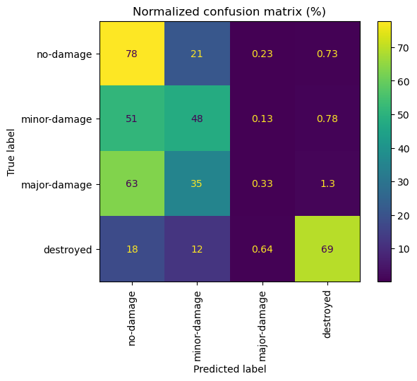
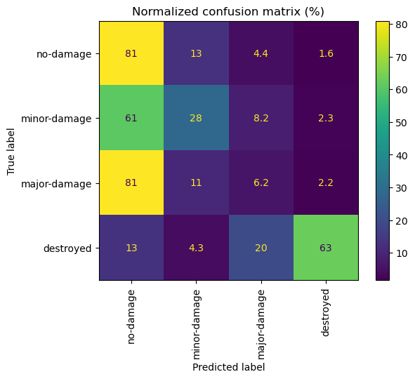
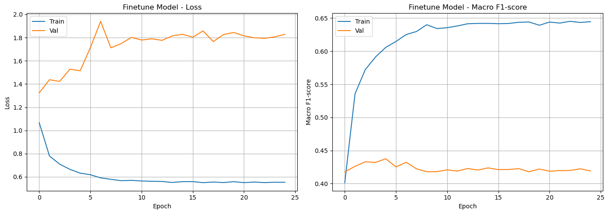

# Building Damage Classification from Satellite Imagery (xBD)

> Deep learning model that classifies the damage level of buildings after natural disasters, using satellite images taken before and after the event.
> Team coursework · BSc in Computer Science and Engineering · Universidad Carlos III de Madrid (2025–2026)

**Language:** English · [Español](./README.es.md)

[](https://www.python.org/)
[](https://pytorch.org/)

---

## The problem

After a natural disaster, rescue teams need to know quickly which buildings are damaged. Manual assessment is slow and dangerous. The [xBD dataset](https://arxiv.org/abs/1911.09296) provides high-resolution satellite image pairs (before and after 19 disasters, including earthquakes, hurricanes, floods, tsunamis and wildfires), with each building labelled on a four-level scale.

The task: given a 64×64 patch centred on a building, predict its damage level. The classes are highly imbalanced, which is the main difficulty.

| Class | Training buildings | Share |
| :--- | ---: | ---: |
| No damage | 50,928 | 83.3% |
| Minor damage | 4,659 | 7.6% |
| Major damage | 2,357 | 3.9% |
| Destroyed | 3,227 | 5.3% |
| **Total** | **61,171** | |

Validation: 8,495 buildings · Test: 22,222 buildings (labels hidden, scored through the course competition).

---

## Approach

**Early fusion of before and after images.** The pre- and post-disaster patches are stacked into a single 6-channel input, so the network can compare both states of the same building instead of judging the post-disaster image alone.

**Two models**

- **Custom CNN**, trained from scratch: four Conv–BatchNorm–ReLU–MaxPool blocks (32 → 256 filters) followed by global average pooling and a linear classifier.
- **ResNet-18 pretrained on ImageNet**, fine-tuned. Because the input has 6 channels instead of 3, the first convolution was rebuilt and the pretrained RGB weights were copied into both the "before" and the "after" channels, preserving the learned visual features for each image. A dropout layer (p = 0.4) was added before the classifier.

**Paired data augmentation** (training only)

- Geometric transforms, applied **identically** to both images: horizontal and vertical flips, and rotations of 0/90/180/270°, since satellite images have no canonical orientation.
- Photometric transforms, applied **independently** to each image: brightness and contrast, since lighting and capture conditions differ between dates.

**Class imbalance.** Cross-entropy loss weighted by inverse class frequency. Models are selected by **macro-F1** on validation, which weights all four classes equally instead of rewarding the majority class.

**Efficiency.** The original pipeline re-read the 1024×1024 TIFF images for every patch in every epoch. Patches are now pre-processed once and cached to disk as tensors, so each training epoch only reads from memory. Each model trains in about 3 minutes on a GPU.

**Training setup.** SGD with momentum 0.9, batch size 512, 25 epochs, learning rate divided by 10 every 7 epochs (initial 1e-2 for the custom CNN; 1e-3 with weight decay 1e-4 for ResNet-18). Fixed seeds (42) for reproducibility.

---

## Results

Validation set (8,495 buildings). Per-class recall is taken at each model's best epoch.

| Model | Macro-F1 (best epoch) | Macro-F1 (mean of last 10 epochs) | Recall: no damage | Recall: minor | Recall: major | Recall: destroyed |
| :--- | :---: | :---: | :---: | :---: | :---: | :---: |
| Custom CNN | 0.450 (epoch 2) | 0.41 | 78% | 48% | 0.3% | 69% |
| ResNet-18 (fine-tuned, 6 channels) | 0.438 (epoch 4) | 0.42 | 81% | 28% | 6.2% | 63% |

**Hidden test set** (course competition on Codabench, 22,222 buildings): the team finished **5th in the class**.

| Model | Macro-F1 (test) |
| :--- | :---: |
| Custom CNN | 0.31 |
| ResNet-18 (fine-tuned, 6 channels) | **0.33** |

<table>
<tr>
<td></td>
<td></td>
</tr>
<tr>
<td align="center">Custom CNN (best epoch)</td>
<td align="center">ResNet-18 (best epoch)</td>
</tr>
</table>



**Observations**

- **The two models perform almost the same.** The custom CNN's best score is an isolated peak: neighbouring epochs sit at 0.39–0.40 and its validation loss is very unstable. Over the last epochs, ResNet-18 is slightly better and more stable (0.42 vs 0.41), and it is also ahead on the test set (0.33 vs 0.31).
- **Overfitting starts early.** Both models reach their best validation F1 within the first five epochs. After that, training macro-F1 keeps rising to 0.63–0.64 while validation stalls at 0.41–0.42 and validation loss increases.
- **Major damage is the main weakness.** The custom CNN almost never predicts it (0.3% recall), mostly confusing it with "no damage" (63%) and "minor damage" (35%). ResNet-18 recognises it slightly more often (6.2%). Minor damage is also often mistaken for no damage. Destroyed buildings, whose visual change is much more obvious, are recognised well (63–69%).
- **Validation overstates performance.** Macro-F1 drops from 0.44–0.45 at the best validation epoch to 0.31–0.33 on the hidden test set. Part of the gap comes from choosing the epoch on the same validation set; the size of the drop suggests the test images are also harder or distributed differently, which cannot be checked because their labels are hidden.

**Next steps:** focal loss or class-balanced sampling for the minority classes, stronger regularisation and augmentation, larger patches that include context around each building, backbones pretrained on remote sensing imagery (e.g. [TorchGeo](https://torchgeo.readthedocs.io/)), and early stopping with patience instead of a fixed 25 epochs.

---

## Tech stack

PyTorch, torchvision, scikit-learn, OpenCV, Shapely, tifffile, NumPy, Matplotlib.

---

## Repository structure

```
xbd-damage-classification/
├── damage_classification.ipynb   # Full pipeline: data, augmentation, models, training and evaluation
├── figures/                      # Confusion matrices, training curves and a sample image pair
├── requirements.txt
├── README.md
└── README.es.md
```

**Running it.** Install the dependencies with `pip install -r requirements.txt` (tested with Python 3.10), place the dataset in `data/xBD_UC3M` and run the notebook top to bottom. A GPU is recommended. You can also open it in Google Colab with the badge at the top of the notebook.

**Data.** The dataset is not included. The notebook uses a subset of xBD provided for the course. The full dataset is available from [xView2](https://www.xview2.org/) under its own licence (CC BY-NC-SA 4.0).

**Course material.** The base dataset class (patch extraction from the xBD annotations), the `ToTensor` and `Normalize` transforms, and the base training and test functions were provided by the course instructors. The 6-channel fusion, both model architectures, the ResNet-18 adaptation, the paired augmentation, the class weighting, the caching pipeline and the results analysis are the team's work.

---

## Authors

Marcos Morales Tello

**Fernando Martín Arencibia** · [LinkedIn](https://www.linkedin.com/in/fernando-martin-arencibia-477257368/) · [GitHub](https://github.com/fernandomartinarencibia) · [Email](mailto:fernandomartinarencibia@gmail.com)

**Reference:** Gupta, R. et al. (2019). *xBD: A Dataset for Assessing Building Damage from Satellite Imagery.* arXiv:1911.09296.
